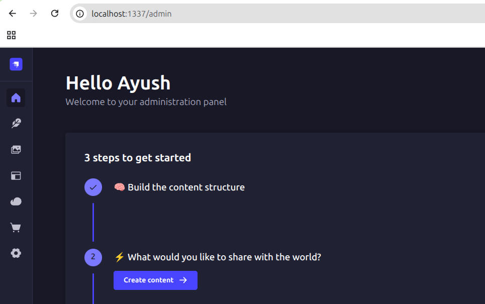
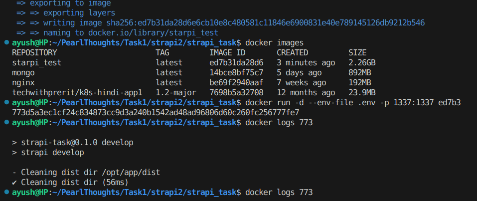

# Task 1
Setup Strapi locally, explored its folder structure, and successfully launched the admin panel. Create a sample content type to test the functionality and pushed the entire setup to GitHub, including a detailed README.md documenting all the steps

## Steps Taken

### 1. Setup the project
- To setup the project copy the command mentioned in the README file in the official repo.
 > https://github.com/strapi/strapi?tab=readme-ov-file#getting-started

```
npx create-strapi@latest
```

- After that if will ask name of the project. Let say I mention `starpi_task`
- Then we will mention rest of the details.
- After that our project setup is done. Then to run the project, command that I used is

```
npm run dev
```


- By default it use Sqlite as database. Then go to the browser and type `http://localhost:1337/`.
- It will ask to setup credentials for admin and thats it. Strapi is setup locally.



---

## 2. Running on Docker (optional)
Then we can run the application inside a docker container, for that we have to write the `Dockerfile`.
- For this I have used the official documentation, [link](https://docs.strapi.io/cms/installation/docker).
- Then I write .gitignore where I mentioned to ignore `.env` and `README` file for now. We can mention other things according to our need.
- Then we build the image using command

```
docker build -t starpi_test . 
```
- Then we run the container using command
```
docker run -d -p 1337:1337 --env-file .env imageid
```
- And container will run normally


---

## 3. Folder structure

For folder structure, using this documentation we can have basic idea about the folder structure [link](https://docs.strapi.io/cms/project-structure)

- `config` - For all configuration files
- `dist` - Build for the backend
- `public` - files accessible to the outside world
- `src`
    
    - `api` - business logic of the project split into subfolders per API
    - `admin` - admin customization files
    - `plugin`- local plugins files

## 4. Content type Builder
For content tyoe builder, followed this documentation to get the basic idea about how to create it [link](https://docs.strapi.io/cms/quick-start#-part-b-build-your-content-structure-with-the-content-type-builder)

- Simply open `http://localhost:1337/admin`
- Click on the Create your first Content type button > Create New content type.
- Then add the desired fields you want and then click save.
This way we can create the new content type builder.

## 5. Loom video
> [link](https://www.loom.com/share/7a984c32ea494c6f84dded414ece844d?sid=bd92e4e6-4da4-4497-be86-dc766a4f9e2a) 

