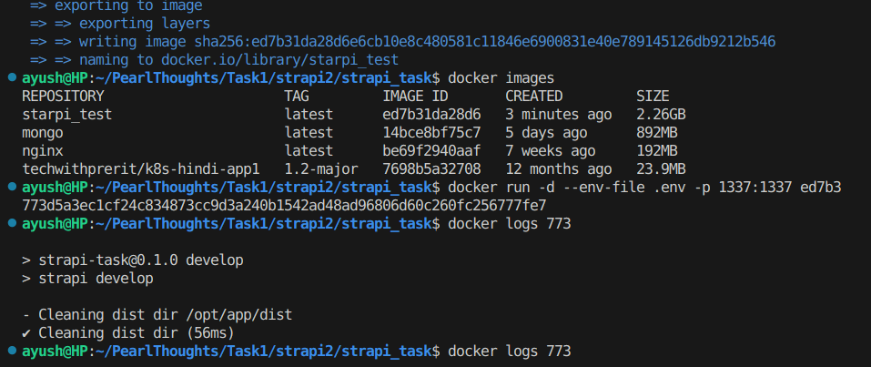

# Task 2
Running Strapi on docker container.

## 1. Running Strapi on Docker
We can run the application inside a docker container, for that we have to write the `Dockerfile`.
- For this I have used the official documentation, [link](https://docs.strapi.io/cms/installation/docker).
- Then I write .gitignore where I mentioned to ignore `.env` and `README` file for now. We can mention other things according to our need.

```dockerfile
FROM node
WORKDIR /opt/
COPY . .
RUN npm install -g node-gyp && npm config set fetch-retry-maxtimeout 600000 -g && npm install
ENV PATH=./node_modules/.bin:$PATH
RUN ["npm", "run", "build"]
EXPOSE 1337
CMD ["npm", "run", "develop"]
```
- Then we build the image using command

```
docker build -t starpi_test . 
```
- Then we run the container using command
```
docker run -d -p 1337:1337 --env-file .env imageid
```
- And container will run normally


<br>

## 2. Running Strapi with docker compose

- Now we can run the Strapi using the compose. But instead of running it with sqlite, we can run the compose with the mysql container and we mount the container data with the volume.

- So we write docker compose code for mysql. Here we mention location of env file so that it can fetch the required variables from the .env file

```yml
# Mysql compose
 mysql:
    container_name: strapi_mysql
    image: mysql:8.0
    env_file: .env
    command: --default-authentication-plugin=mysql_native_password
    environment:
      MYSQL_ROOT_PASSWORD: ${MYSQL_ROOT_PASSWORD}
      MYSQL_DATABASE: ${MYSQL_DATABASE}
      MYSQL_USER: ${MYSQL_USER}
      MYSQL_PASSWORD: ${MYSQL_PASSWORD}
    volumes:
      - ./strapi_db/backup:/var/lib/mysql
    networks:
      - strapi
    ports:
      - 3306:3306

```
- And then we mention below details in the .env file. This way our image will fetch the details from .env file.

```
MYSQL_ROOT_PASSWORD=rootpassword
MYSQL_DATABASE=strapidb
MYSQL_USER=myuser
MYSQL_PASSWORD=mypassword
```

- And similarly for strapi app we can mention as. Here it will build the docker image from the Dockerfile which we mentioned in the directory.

```yml
 strapi:
    build: .
    container_name: strapi
    env_file: .env
    environment:
      DATABASE_CLIENT: ${DATABASE_CLIENT}
      DATABASE_HOST: ${DATABASE_HOST}
      DATABASE_PORT: ${DATABASE_PORT}
      DATABASE_NAME: ${DATABASE_NAME}
      DATABASE_USERNAME: ${DATABASE_USERNAME}
      DATABASE_PASSWORD: ${DATABASE_PASSWORD}
      DATABASE_SSL: ${DATABASE_SSL}
      ADMIN_JWT_SECRET: ${ADMIN_JWT_SECRET}
      APP_KEYS: ${APP_KEYS}
      NODE_ENV: ${NODE_ENV}
    ports:
      - 1337:1337
    depends_on:
      - mysql
    networks:
      - strapi

```

- Then simply run the command 
> docker compo up -d --build

- Then we can simply use 
> docker compose logs -f

to see all the logs of the compose we are running. If it shows no error then our appilication is simly running successfully.

- Complete code is present in the `docker-compose.yml`