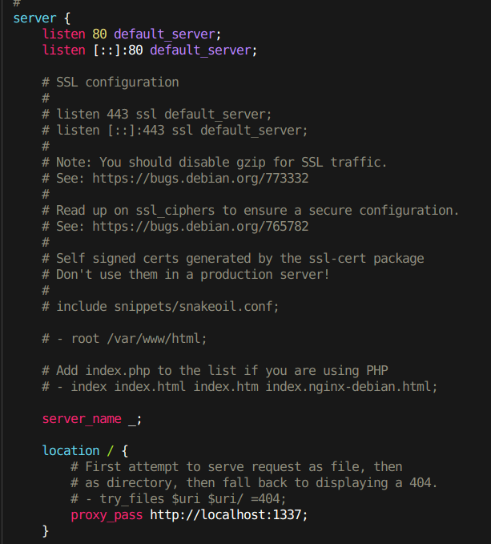
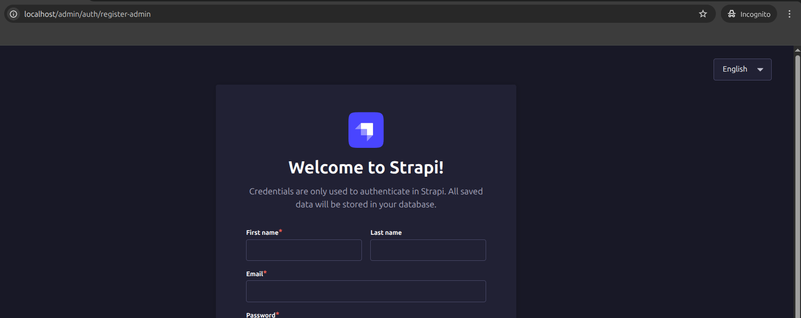

# Task 3
Set up a Dockerized environment with the following requirements:
- Use Docker networking to connect a Strapi container with a PostgreSQL database container.
- Configure Nginx as a reverse proxy to expose the Strapi Admin Dashboard on port 80.
- Ensure all containers run on the same user-defined Docker network.
- Final result: Access Strapi via http://localhost.

---

> <center>All files are inside Task3_strapi folder</center>

## 1. Running Strapi with PostgreSQL Using Docker Networking
- To run PostgresSQL and Strapi in same network, we can use the `docker-compose.yml`
- First we have `Dockerfile` for the Strapi

``` dockerfile
FROM node
WORKDIR /app
COPY . .
RUN npm install -g node-gyp && npm config set fetch-retry-maxtimeout 600000 -g && npm install
ENV PATH=./node_modules/.bin:$PATH
RUN ["npm", "run", "build"]
EXPOSE 1337
CMD ["npm", "run", "develop"]
```

- Then for the PostgreSQL we can wirte docker-compose.yml as

```yml
version: '3'
services:
  postgres:
    container_name: strapi_postgres
    image: postgres:16.0-alpine
    env_file: .env
    environment:
      POSTGRES_USER: ${POSTGRES_USER}
      POSTGRES_PASSWORD: ${POSTGRES_PASSWORD}
      POSTGRES_DB: ${POSTGRES_DB}
    volumes:
      - ./strapi_db/backup:/var/lib/postgresql/data
    networks:
      - strapi
    ports:
      - 5432:5432
```
- Then we have to mention these variables in the `.env` file so that our Postgres container will config this at the time of creation.

``` yml
# POSTGRES
POSTGRES_USER=
POSTGRES_PASSWORD=
POSTGRES_DB=
```
- Then we need to mention Strapi container configuration details in the docker-compose.yml

``` yml
  strapi:
    container_name: strapi
    build:
      dockerfile: Dockerfile
    env_file: .env
    environment:
      DATABASE_CLIENT: ${DATABASE_CLIENT}
      DATABASE_HOST: ${DATABASE_HOST}
      DATABASE_PORT: ${DATABASE_PORT}
      DATABASE_NAME: ${DATABASE_NAME}
      DATABASE_USERNAME: ${DATABASE_USERNAME}
      DATABASE_PASSWORD: ${DATABASE_PASSWORD}
      JWT_SECRET: ${JWT_SECRET}
      ADMIN_JWT_SECRET: ${ADMIN_JWT_SECRET}
      APP_KEYS: ${APP_KEYS}
      NODE_ENV: ${NODE_ENV}
    ports:
      - "1337:1337"
    depends_on:
      - postgres

networks:
  strapi:
    name: Strapi
    driver: bridge
```
- And mention rest of the details in the .env also.

```yml
# Database details for strapi app
DATABASE_CLIENT=
DATABASE_HOST=
DATABASE_PORT=
DATABASE_NAME=
DATABASE_USERNAME=
DATABASE_PASSWORD=
DATABASE_SSL=false
DATABASE_FILENAME=.tmp/data.db
JWT_SECRET=EanOC7TaoUj/t/WqN/z2Rw==
```
- You can also define the `.dockerignore` to ignore the files and folder which you dont want in the docekr image.

- Then simply run the container using the compose using 
> docker compose up -d --build

- You can check the logs using 
> docker compose logs -f

## 2. Configuring with nginx

- Now to configure with nginx, we can change the default file of the nginx. 
- For that we can go to `/etc/nginx/sites-available` and then `sudo vim default`
- And then under localhost we can define proxy as 
```bash
location /{
    proxy_pass http://localhost:1337
}
```


- Then we go to the browser and type localhost and it will work.


